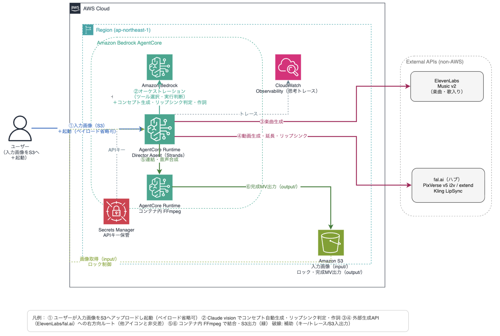

# agentcore-mv-director

A "creative director" AI agent running on Amazon Bedrock AgentCore.
Place images in S3 and send an empty payload — **Strands Agent (Claude) autonomously orchestrates** concept generation, lyrics, multi-cut video, and music into one finished MV (PoC).

- **AI orchestration**: Strands Agent (Claude) decides which tools to call and in what order
- **Concept**: Claude vision analyzes input images and auto-generates the MV concept
- **Lipsync detection**: Claude vision judges per-image whether the person is facing the camera in close-up — only those cuts get lipsync applied (no filename convention needed)
- **Lyrics**: Bedrock (Claude) generates original English lyrics matching the concept
- **Music**: ElevenLabs Music v2 (female vocals by default)
- **Video**: fal.ai PixVerse v5 image-to-video (per cut)
- **Lipsync**: fal.ai Kling LipSync (full mix, no stem separation needed)
- **Concat**: FFmpeg
- **Output**: Amazon S3 (`output/mv.mp4`)
- **Observability**: CloudWatch logs + OpenTelemetry traces (AgentCore built-in)
- **Concurrency guard**: S3 lock file prevents duplicate invocations (fal.ai / ElevenLabs cost protection)

## Architecture



## Layout

```
main.py                  # AgentCore entrypoint — Strands Agent + 4 tools
  ├─ download_input_images    # Download images from S3 input/
  ├─ generate_mv_concept      # Claude vision → MV concept
  ├─ generate_music_and_lyrics # Claude → music style + lyrics
  └─ produce_music_video      # Storyboard + pipeline → S3 upload
mvcore/
  director.py            # Bedrock (Claude) — concept / lipsync judgment / lyrics
  pipeline.py            # storyboard -> MV pipeline
  schema.py              # Storyboard schema / validation
  config.py              # config (auto dry-run when keys are absent)
  tools/                 # music / video / lipsync / assemble / storage (S3)
cdk/                     # S3 / Secrets Manager / IAM / AgentCore Runtime (TypeScript)
```

## Setup

### 1. Clone & deploy CDK

```bash
git clone https://github.com/furuya02/agentcore-mv-director.git
cd agentcore-mv-director/cdk
pnpm install
pnpm run cdk deploy -- --require-approval never
```

### 2. Put API keys into Secrets Manager

```bash
aws secretsmanager put-secret-value \
  --secret-id agentcore-mv-director-api-keys \
  --secret-string '{"FAL_KEY":"...","ELEVENLABS_API_KEY":"..."}'
```

### 3. Upload input images to S3

```bash
aws s3 cp input/ s3://agentcore-mv-director-<ACCOUNT_ID>/input/ --recursive
```

Image naming: number your files (`1.jpg`, `2.jpg`, …) — they are processed in ascending numeric order.
Claude vision automatically determines which images are close-up / camera-facing (lipsync targets).

## Invoke

```bash
echo '{}' > /tmp/payload.json

aws bedrock-agentcore invoke-agent-runtime \
  --agent-runtime-arn "<RUNTIME_ARN>" \
  --payload fileb:///tmp/payload.json \
  --cli-read-timeout 0 \
  --region ap-northeast-1 \
  /tmp/response.json && cat /tmp/response.json
```

An empty payload `{}` is all that is needed. Strands Agent (Claude) handles everything automatically:

| Step | What Claude decides |
|------|---------------------|
| Images | Loaded from `s3://<bucket>/input/` in numeric filename order |
| Concept | Claude vision analyzes all images and generates the concept |
| Music & Lyrics | Claude generates music style + original English lyrics from the concept |
| Lipsync | Claude vision judges each image — close-up + camera-facing → lipsync applied |
| Vocal | Female vocal (fixed) |

## Observability

```bash
aws logs tail "/aws/bedrock-agentcore/runtimes/<agent_id>-DEFAULT" \
  --follow --format short --region ap-northeast-1
```

Each tool logs its start, decisions, and results. Example output:

```
============================================================
[tool:start] generate_mv_concept
  対象画像: 3枚
[tool:done] generate_mv_concept
  → コンセプト: A cinematic journey through sun-drenched streets...
============================================================
[tool:start] produce_music_video
  [絵コンテ完成] 3カット / 総尺 24秒
    cut1: 8秒 [✓ リップシンク対象] portrait of woman looking directly at camera...
    cut2: 8秒 [  映像のみ        ] panoramic view of golden hills at sunset...
[tool:done] produce_music_video
  → S3 URI: s3://agentcore-mv-director-<ACCOUNT_ID>/output/mv.mp4
```

## Tear down (avoid lingering cost)

```bash
cd cdk && pnpm run cdk destroy
```

## Cost

- Video: ~$0.05–0.10 per cut (fal.ai PixVerse v5)
- Lipsync: ~$0.05 per singing cut (fal.ai Kling)
- Music: ~$0.03 per track (ElevenLabs Music v2)
- AgentCore: consumption-based (I/O wait is free)
- Generated songs are for in-MV background use only; uploading to music streaming services is not permitted (ElevenLabs terms)
